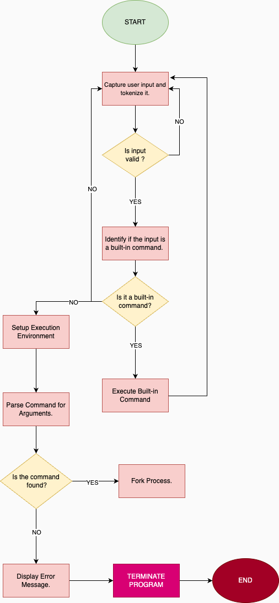

# Simple Shell - `hsh`

## Project Overview

The `hsh` project is a Unix-like command-line interpreter that mimics the behavior of the Thompson shell, one of the earliest shells used in Unix systems. This simple shell is designed to execute user commands, manage processes, and interact with the system environment.

## Features

- **Interactive Mode:** `hsh` displays a prompt and waits for user input. It executes commands provided by the user, displaying output and errors as needed.
- **Non-interactive Mode:** `hsh` can process commands from a file or pipe input, executing them in sequence without requiring user interaction.
- **Built-in Commands:**
  - `exit`: Exits the shell.
  - `env`: Prints the current environment variables.
- **Error Handling:** The shell handles common errors, such as command not found, and provides appropriate error messages.
- **PATH Handling:** The shell can search for executables in the directories listed in the PATH environment variable.
- **Process Management:** Uses system calls like `fork` and `execve` to create and manage processes.
- **Memory Management:** Ensures no memory leaks by managing dynamic memory allocations.

## Requirements

- **Operating System:** Ubuntu 20.04 LTS
- **Compiler:** GCC with the options `-Wall -Werror -Wextra -pedantic -std=gnu89`
- **Code Style:** Betty coding style guidelines
- **Editors:** vi, vim, emacs

## Compilation

To compile the shell, use the following command:

```bash
gcc -Wall -Werror -Wextra -pedantic -std=gnu89 *.c -o hsh
```

## Usage

### Interactive Mode

```bash
$ ./hsh
($) /bin/ls
hsh main.c shell.c
($) exit
$
```

### Non-interactive Mode

```bash
$ echo "/bin/ls" | ./hsh
hsh main.c shell.c
$
```

## Files

- `main.h`: Header file containing function prototypes and macros.
- `shell_main.c`: Main entry point of the shell program.
- `shell_execute.c`: Contains the logic for command execution.
- `path.c`: Handles PATH resolution for executable files.
- `man_1_simple_shell`: Man page for the `hsh` shell.
- `AUTHORS`: List of contributors to the project.

## Contributors

- Sabillva: [GitHub](https://github.com/Sabillva)
- Sadatnazarli: [GitHub](https://github.com/sadatnazarli)

## License

This project is licensed under the MIT License.

